# The Fan

> **아이돌 포토카드 NFT 마켓 플레이스**

<div align="center" style="text-align: center">


   
<h2 style="text-align: center">Main</h2>
<div align="center" style="text-align: center">

</div>

<h2 style="text-align: center">My page</h2>
<div align="center" style="text-align: center">

</div>

<h2 style="text-align: center">카드팩 구매</h2>
<div align="center" style="text-align: center">

</div>

<h2 style="text-align: center">유저간 카드 거래</h2>
<div align="center" style="text-align: center">

<h4 style="text-align: center">유저간 카드 거래 - 구매</h4>

<h4 style="text-align: center">유저간 카드 거래 - 등록</h4>
</div>

<h2 style="text-align: center">갤러리</h2>
<div align="center" style="text-align: center">

<h4 style="text-align: center">갤러리 - 내 갤러리</h4>

<h4 style="text-align: center">갤러리 - 갤러리 게시판</h4>
</div>


#### 서비스 설명

아이돌 소속사와 협력한다는 가정 하에 포토카드 NFT를 출시하고 이를 거래할 수 있는 웹서비스 입니다.
이더리움 프라이빗 네트워크를 구성해 그 안에서 유저의 개인계정과 이더리움을 통해 거래를 할 수 있게 하였고  NFT를 발행해 포토카드에 희소성과 고유성을 부여하고 소유자를 인증해주었습니다.
포토카드에 등급을 부여했고 등급별로 출시 개수를 달리했습니다. 5장씩 들어있는 종류별 카드팩을 통해 랜덤으로 카드를 얻을 수 있게하는 재미 요소를 추가했습니다. 
또한 유저간 거래를 통해 높은 등급 카드의 가치가 자연스레 높아지도록 했고 갤러리와 갤러리 게시판을 통해 전시도 가능하게 하여 유저들의 수집욕구를 더욱 높였습니다.

#### 파일구조

- Frontend

```
📦Frontend
├─ 📂public
│  ├─ 📂image
│  └─ 📂videos
└─ 📂src
    └─ 📂components
        ├─ 📂account
        │  ├─ 📂join
        │  ├─ 📂login
        │  └─ 📂mypage
        │      ├─ 📂market
        │      ├─ 📂shop
        │      └─ 📂update
        ├─ 📂cardpackshop
        ├─ 📂gallery
        ├─ 📂main
        ├─ 📂market
        ├─ 📂pages
        └─ 📂service
```

- Backend

```
📦backend
    📂gradle
    │  📂7.1.1
    │  │  📂dependencies-accessors
    │  │  📂executionHistory
    │  │  📂fileChanges
    │  │  📂fileHashes
    │  │  📂vcsMetadata-1
    │  📂buildOutputCleanup
    │  📂checksums
    │  📂vcs-1
    📂settings
    📂bin
    │  📂default
    │  │  📂com
    │  │      📂blockChain
    │  │          📂domain
    │  📂main
    │  │  📂com
    │  │      📂blockChain
    │  │          📂config
    │  │          📂controller
    │  │          📂domain
    │  │          📂dto
    │  │          📂jwt
    │  │          📂repository
    │  │          │  📂Impl
    │  │          📂service
    │  📂test
    │      📂com
    │          📂blockChain
    │              📂backend
    📂build
    │  📂classes
    │  │  📂java
    │  │      📂main
    │  │      │  📂com
    │  │      │      📂blockChain
    │  │      │          📂config
    │  │      │          📂controller
    │  │      │          📂domain
    │  │      │          📂dto
    │  │      │          📂wt
    │  │      │          📂repository
    │  │      │          │  📂Impl
    │  │      │         📂service
    │  │      📂test
    │  │          📂com
    │  │              📂blockChain
    │  │                  📂backend
    │  📂generated
    │  │  📂sources
    │  │      📂annotationProcessor
    │  │      │  📂java
    │  │      │      📂main
    │  │      │      │  📂com
    │  │      │      │      📂blockChain
    │  │      │      │          📂domain
    │  │      │      📂test
    │  │      📂headers
    │  │          📂java
    │  │              📂main
    │  │              📂test
    │  📂libs
    │  📂reports
    │  │  📂tests
    │  │      📂test
    │  │          📂classes
    │  │          📂css
    │  │          📂js
    │  │          📂packages
    │  📂resources
    │  │  📂main
    │  📂test-results
    │  │  📂test
    │  │      📂binary
    │  📂tmp
    │      📂bootJar
    │      📂compileJava
    │      📂compileTestJava
    │      📂jar
    │      📂test
    📂gradle
    │  📂wrapper
    📂src
        📂main
        │  📂java
        │  │  📂com
        │  │      📂blockChain
        │  │          📂config
        │  │          📂controller
        │  │          📂domain
        │  │          📂dto
        │  │          📂jwt
        │  │          📂repository
        │  │          │  📂Impl
        │  │          📂service
        │  📂resources
        📂test
            📂java
                📂com
                    📂blockChain
                        📂backend
```

#### 사용 방법

##### 1) 사이트 접속(현재 서버 내림)


##### 2) 상단 메뉴에서 JOIN 클릭


##### 3) 회원가입

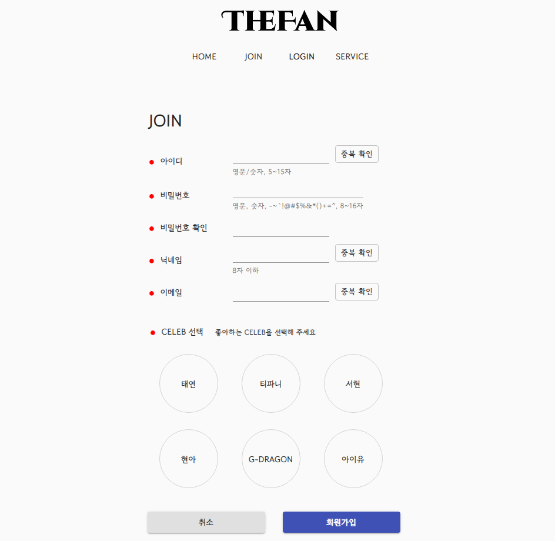

- 아이디, 비밀번호, 닉네임은 조건 충족 필요
- 아이디, 닉네임, 이메일 중복 확인 필요


##### 4) 회원가입 성공 후, 상단 메뉴에서 LOGIN 클릭


##### 5) 가입한 아이디와 비밀번호 입력

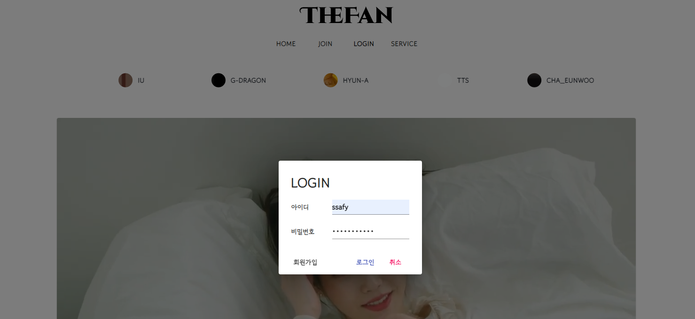


##### 6) 상단 메뉴에서 MY PAGE 클릭


##### 7) 지갑 생성 버튼 클릭

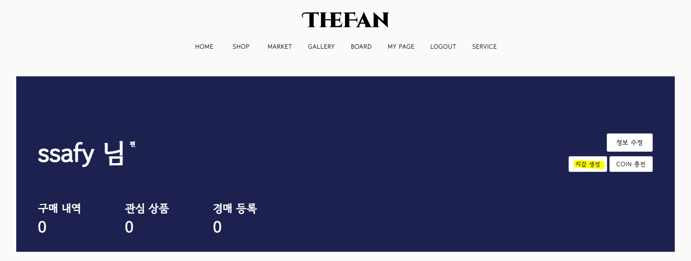

- 시간이 다소 소요될 수 있음
- 지갑 생성 중이라는 표시가 사라지고, 닉네임 옆에 잔액 칸이 생성되면 지갑 생성 성공


##### 8) COIN 충전 버튼 클릭

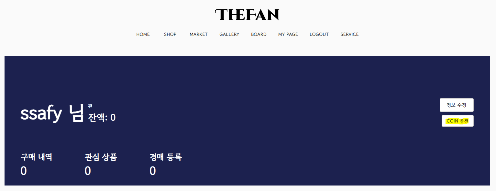

- 시간이 다소 소요될 수 있음
- 잔액이 7이되면 COIN 충전이 완료된 것


##### 9) 상단 메뉴에서 SHOP 클릭


##### 10) 원하는 카드팩을 선택하여 클릭

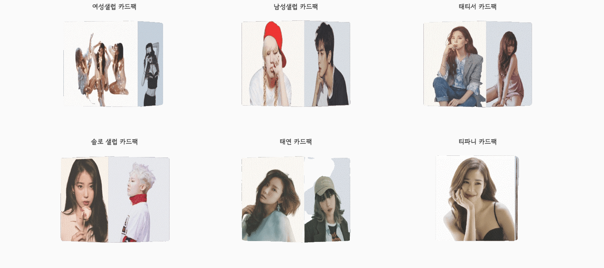


##### 11) 구매하기 버튼 클릭

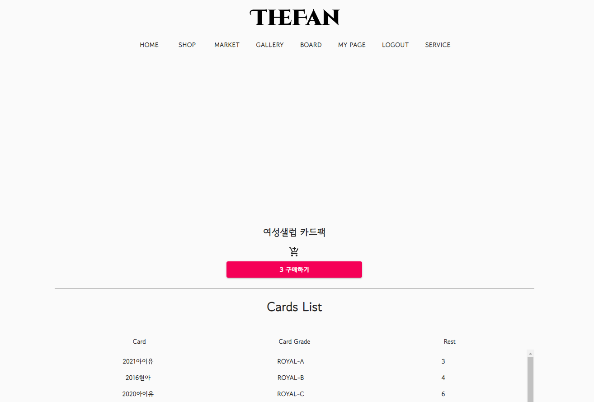

- 시간이 다소 소요될 수 있음


##### 12) 구매에 성공하면 뽑은 카드 확인 가능

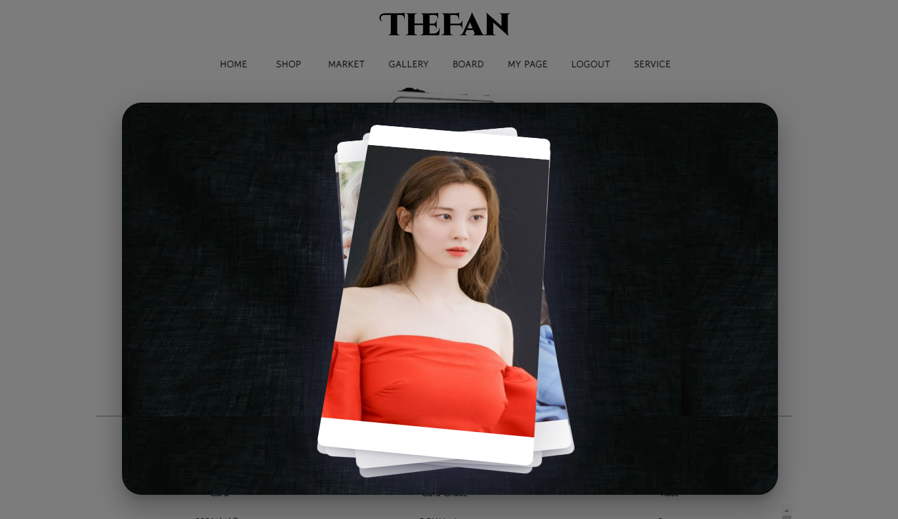


##### 13) 상단 메뉴에 GALLERY 클릭


##### 14) 뽑은 카드 확인 

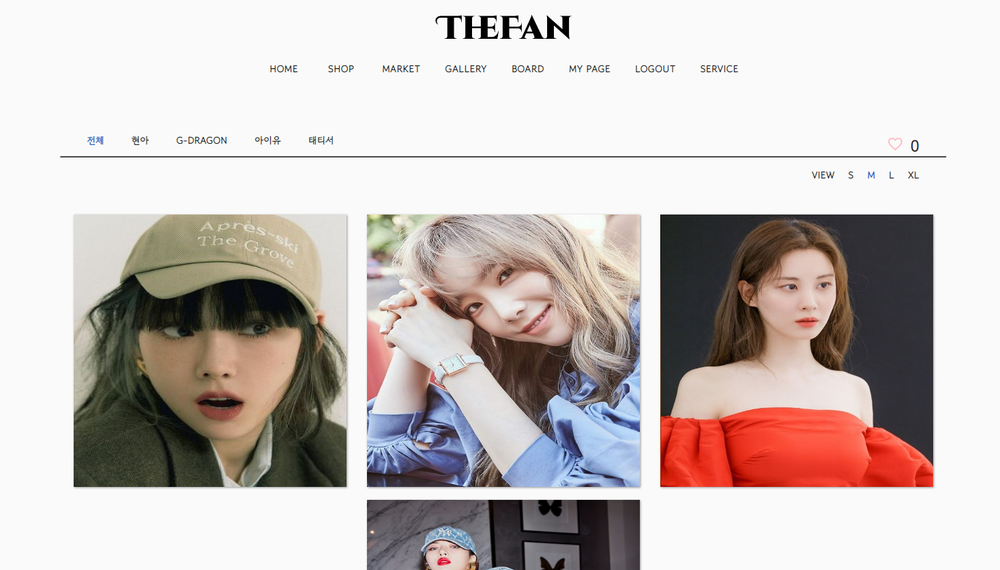


##### 15) 상단 메뉴에서 BOARD 클릭


##### 16) 갤러리 게시판

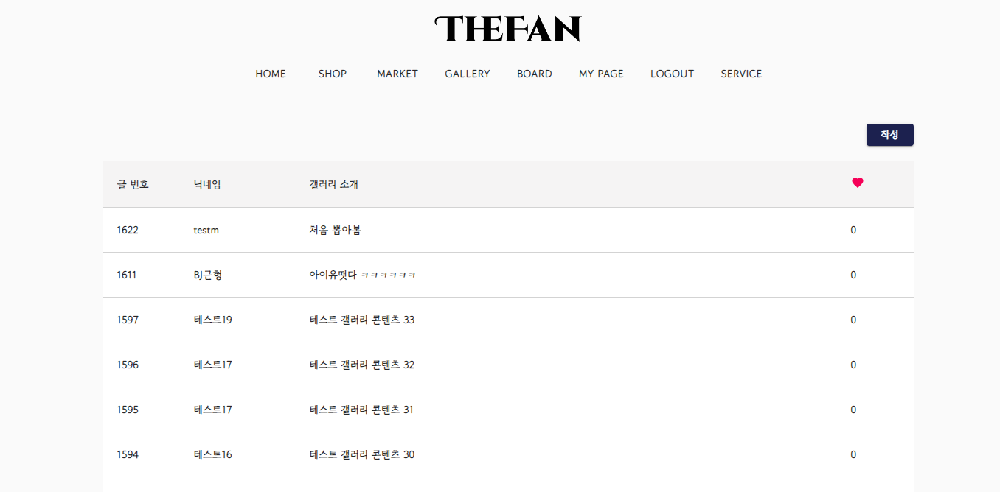

- 작성 버튼 클릭해 게시글 작성 가능
- 게시글 클릭을 통해 다른 사람 갤러리로 이동 가능


##### 17) 상단 메뉴에서 MARKET 클릭


##### 18) MARKET

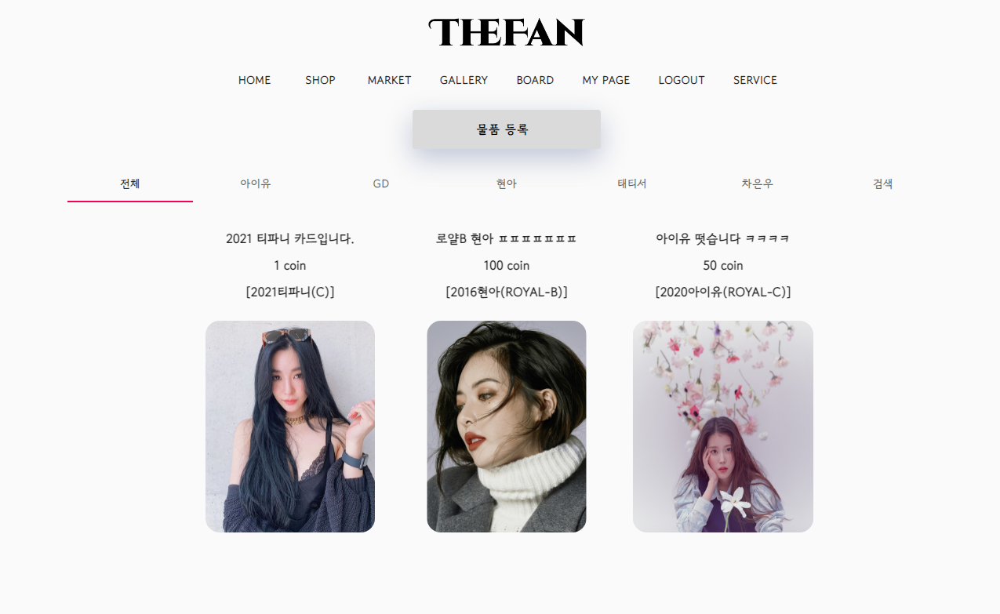


##### 19) 물품 등록 클릭

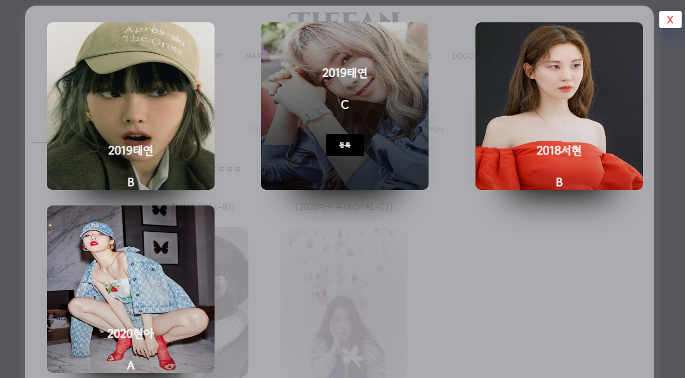

- 내가 가진 카드들 중 판매하고 싶은 카드를 선택
- 제목, 내용, 가격을 작성해 카드를 MARKET에 등록 가능


##### 20) MARKET 카드 검색

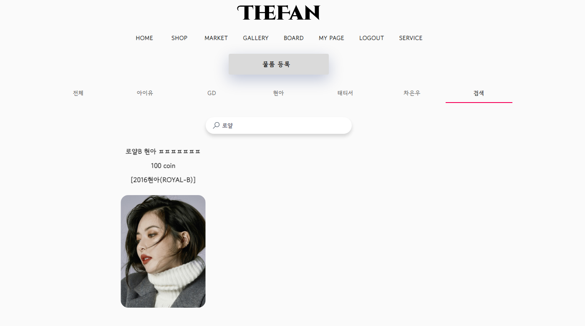

- 카드 이름이 아닌, MARKET 제목으로 검색 


##### 21) MARKET 카드 구매

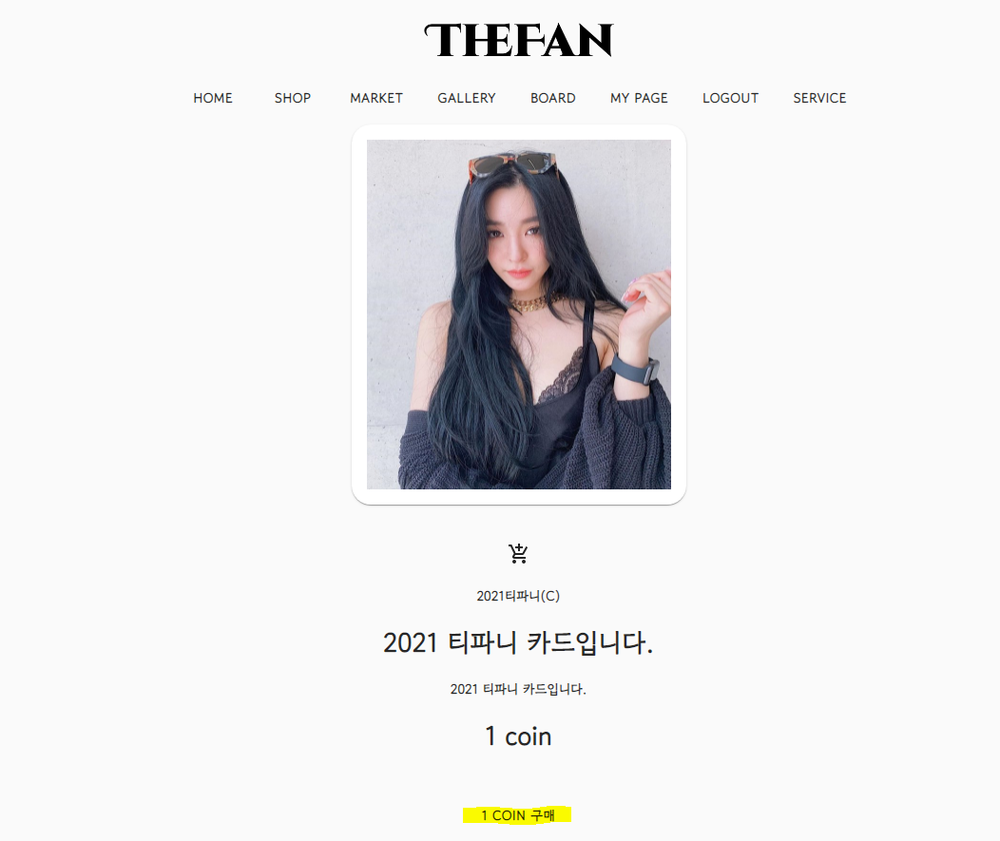

- 시간이 다소 소요될 수 있음
- 구매가 완료되면 구매 진행창이 사라짐


##### 21) 갤러리에서 구매 카드 확인

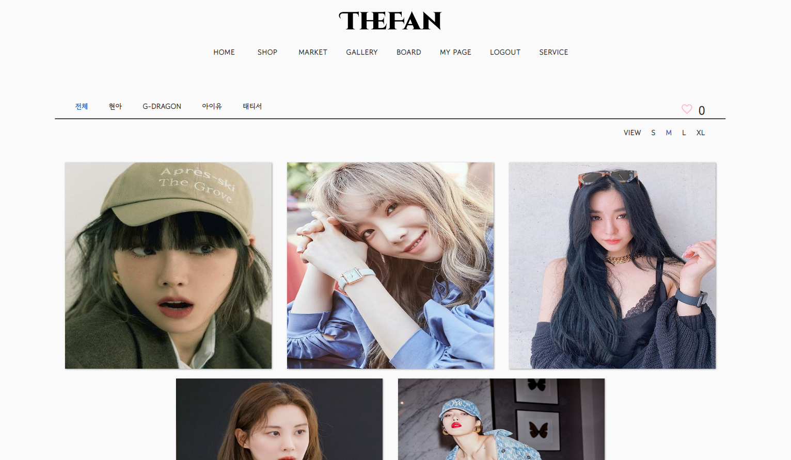
