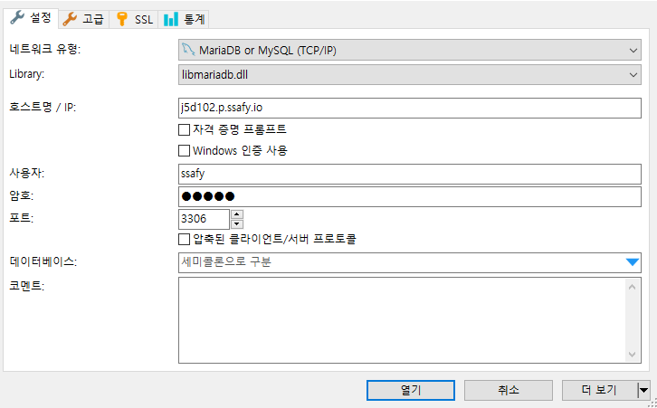
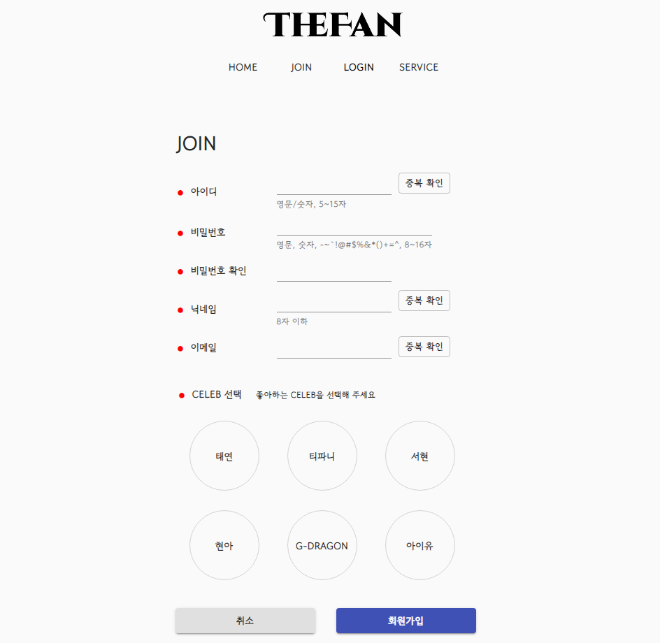
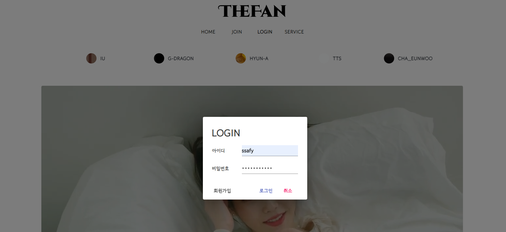
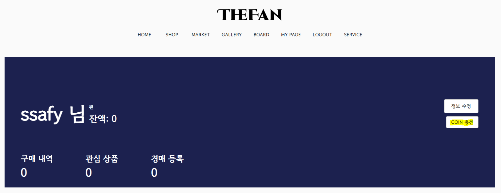
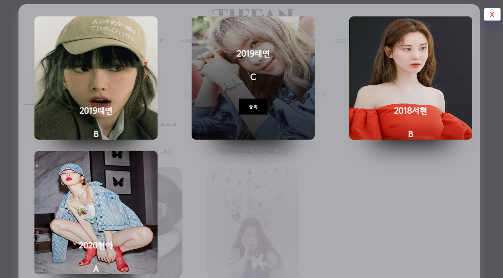
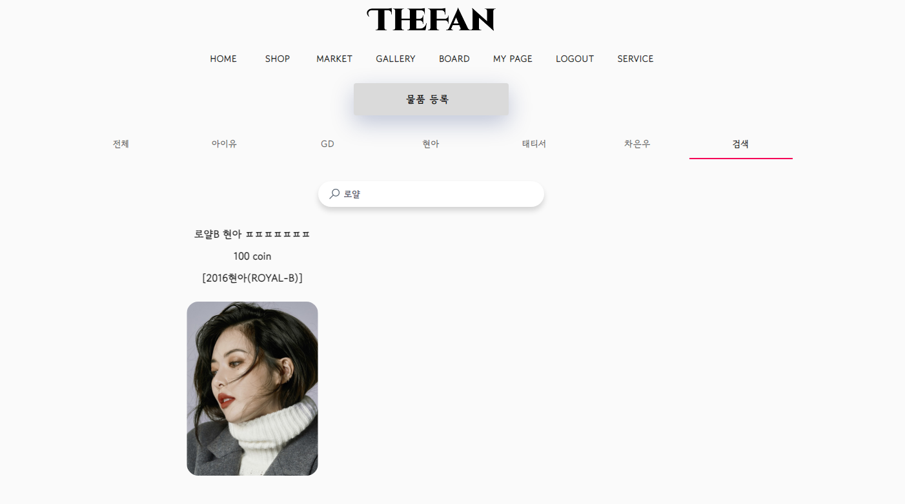

### 포팅메뉴얼

#### :computer: 개발버전

- :eyes:Frontend 
  - animate.css: ^4.1.1
  - axios: ^0.21.4
  - cors: ^2.8.5
  - http-proxy-middleware: ^2.0.1
  - jwt-decode: ^3.1.2
  - react: ^17.0.2
  - react-countdown: ^2.3.2
  - react-dom: ^17.0.2
  - react-jsx: ^1.0.0
  - react-redux: ^7.2.5
  - react-router-dom: ^5.3.0
  - react-scripts: 4.0.3
  - react-spinners: ^0.11.0
  - react-spring: ^9.2.4
  - redux: ^4.1.1
  - typescript: ^4.4.2
- :back: Backend
  - Spring boot^2.5.2
  - gradle^7.1.1
  - Spring Security
  - jjwt^0.11.2
  - Spring Data JPA
  - QueryDsl^4.3.1
  - MariaDB
- :chains: BlockChain
  - Go Ethereum(Geth) : ^1.10.8
  - Go:  ^go1.16.4
  - Solidity: ^0.5.0
  - web-vitals: ^1.1.2
  - web3.js: ^1.5.3
  - web3j: ^4.8.7

#### Start with Local

```
cd frontend
npm install
npm start
```

#### Mining start & Mining stop

```
geth attach http://13.125.37.55:8548
miner.start(1)
miner.stop()
```

#### 데이터베이스

- 버전
  mariadb^10.6

- 접속정보 

  호스트명/ ip : j5d102.p.ssafy.io
  포트 3306
  사용자 : ssafy
  암호 : ssafy




#### 외부서비스 문서 참조

- BlockChain파트
  - web3j : https://docs.web3j.io/4.8.7/
  - web3js : https://web3js.readthedocs.io/en/v1.5.2/#
  - Go Ethereum : https://geth.ethereum.org/docs/


#### 기획배경

가상데이터를 판매하는 사이트를 접하고 어떤것을 팔면 시장이 활성화가 될까 고민을 하게 되었습니다. 

개인, 기업간에도 꾸준한 수요와 공급이 존재하고있는 연예인, 아이돌 포토카드시장에 주목하게 되었고 

이에 NFT기술을 활용해 소유자를 등록해줌으로써 해당 카드를 소유하고 

갤러리를 오픈해 남들과 공유할 수 있는 'TheFan' 웹플랫폼을 기획하게 되었습니다.


#### 파일구조

- Frontend

```
📦Frontend
├─ 📂public
│  ├─ 📂image
│  └─ 📂videos
└─ 📂src
    └─ 📂components
        ├─ 📂account
        │  ├─ 📂join
        │  ├─ 📂login
        │  └─ 📂mypage
        │      ├─ 📂market
        │      ├─ 📂shop
        │      └─ 📂update
        ├─ 📂cardpackshop
        ├─ 📂gallery
        ├─ 📂main
        ├─ 📂market
        ├─ 📂pages
        └─ 📂service
```

- Backend

```
📦backend
    📂gradle
    │  📂7.1.1
    │  │  📂dependencies-accessors
    │  │  📂executionHistory
    │  │  📂fileChanges
    │  │  📂fileHashes
    │  │  📂vcsMetadata-1
    │  📂buildOutputCleanup
    │  📂checksums
    │  📂vcs-1
    📂settings
    📂bin
    │  📂default
    │  │  📂com
    │  │      📂blockChain
    │  │          📂domain
    │  📂main
    │  │  📂com
    │  │      📂blockChain
    │  │          📂config
    │  │          📂controller
    │  │          📂domain
    │  │          📂dto
    │  │          📂jwt
    │  │          📂repository
    │  │          │  📂Impl
    │  │          📂service
    │  📂test
    │      📂com
    │          📂blockChain
    │              📂backend
    📂build
    │  📂classes
    │  │  📂java
    │  │      📂main
    │  │      │  📂com
    │  │      │      📂blockChain
    │  │      │          📂config
    │  │      │          📂controller
    │  │      │          📂domain
    │  │      │          📂dto
    │  │      │          📂wt
    │  │      │          📂repository
    │  │      │          │  📂Impl
    │  │      │         📂service
    │  │      📂test
    │  │          📂com
    │  │              📂blockChain
    │  │                  📂backend
    │  📂generated
    │  │  📂sources
    │  │      📂annotationProcessor
    │  │      │  📂java
    │  │      │      📂main
    │  │      │      │  📂com
    │  │      │      │      📂blockChain
    │  │      │      │          📂domain
    │  │      │      📂test
    │  │      📂headers
    │  │          📂java
    │  │              📂main
    │  │              📂test
    │  📂libs
    │  📂reports
    │  │  📂tests
    │  │      📂test
    │  │          📂classes
    │  │          📂css
    │  │          📂js
    │  │          📂packages
    │  📂resources
    │  │  📂main
    │  📂test-results
    │  │  📂test
    │  │      📂binary
    │  📂tmp
    │      📂bootJar
    │      📂compileJava
    │      📂compileTestJava
    │      📂jar
    │      📂test
    📂gradle
    │  📂wrapper
    📂src
        📂main
        │  📂java
        │  │  📂com
        │  │      📂blockChain
        │  │          📂config
        │  │          📂controller
        │  │          📂domain
        │  │          📂dto
        │  │          📂jwt
        │  │          📂repository
        │  │          │  📂Impl
        │  │          📂service
        │  📂resources
        📂test
            📂java
                📂com
                    📂blockChain
                        📂backend
```

#### 시연이미지

##### 1) http://j5d102.p.ssafy.io/ 사이트 접속


##### 2) 상단 메뉴에서 JOIN 클릭


##### 3) 회원가입



- 아이디, 비밀번호, 닉네임은 조건 충족 필요
- 아이디, 닉네임, 이메일 중복 확인 필요


##### 4) 회원가입 성공 후, 상단 메뉴에서 LOGIN 클릭


##### 5) 가입한 아이디와 비밀번호 입력




##### 6) 상단 메뉴에서 MY PAGE 클릭


##### 7) 지갑 생성 버튼 클릭


- 시간이 다소 소요될 수 있음
- 지갑 생성 중이라는 표시가 사라지고, 닉네임 옆에 잔액 칸이 생성되면 지갑 생성 성공


##### 8) COIN 충전 버튼 클릭



- 시간이 다소 소요될 수 있음
- 잔액이 7이되면 COIN 충전이 완료된 것


##### 9) 상단 메뉴에서 SHOP 클릭


##### 10) 원하는 카드팩을 선택하여 클릭


##### 11) 구매하기 버튼 클릭


- 시간이 다소 소요될 수 있음


##### 12) 구매에 성공하면 뽑은 카드 확인 가능


##### 13) 상단 메뉴에 GALLERY 클릭


##### 14) 뽑은 카드 확인 


##### 15) 상단 메뉴에서 BOARD 클릭


##### 16) 갤러리 게시판


- 작성 버튼 클릭해 게시글 작성 가능
- 게시글 클릭을 통해 다른 사람 갤러리로 이동 가능


##### 17) 상단 메뉴에서 MARKET 클릭


##### 18) MARKET


##### 19) 물품 등록 클릭



- 내가 가진 카드들 중 판매하고 싶은 카드를 선택
- 제목, 내용, 가격을 작성해 카드를 MARKET에 등록 가능


##### 20) MARKET 카드 검색



- 카드 이름이 아닌, MARKET 제목으로 검색 


##### 21) MARKET 카드 구매


- 시간이 다소 소요될 수 있음
- 구매가 완료되면 구매 진행창이 사라짐


##### 21) 갤러리에서 구매 카드 확인


#### 시연스크립트


